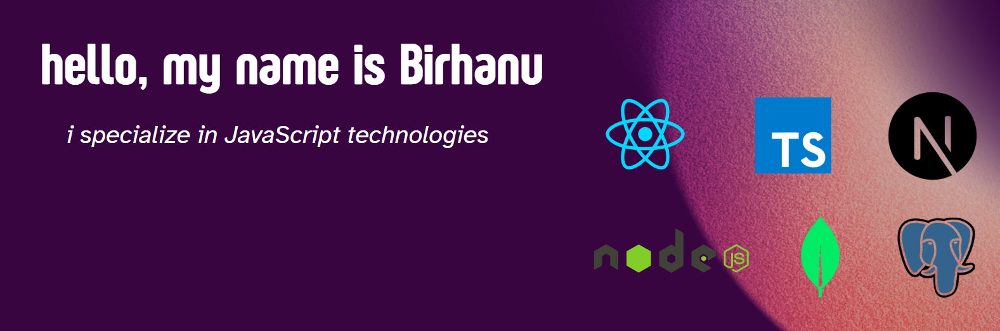

# 👋 Hey, I am BIRHANU DEJEN

As a Full-Stack  Engineer based in the vibrant city of Addis Ababa, Ethiopia,  Proficient in a diverse array of technologies including TypeScript, JavaScript, React, React Native, Node.js, Next.js and databases like PostgreSQL and MongoDB, I thrive on transforming complex challenges into elegant solutions.

My passion lies in engineering seamless user experiences that resonate with end users. With a relentless curiosity for emerging technologies, I am eager to explore innovative projects both remotely and in-person around the globe. If you’re seeking a dedicated engineer ready to make a significant impact on your team, don’t hesitate to reach out!

## 🌐 Socials:

## 💻 Tech Stack:

